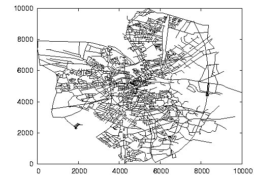

# Road Network Analysis
## Final Project CS 225
## Erin Dowdy, Hania Dziurdzik, Fantah Kabba, Owen Michuda

### Building/Running the Code

After cloning the repository, running the code on a road network requires two CSV files: one of the coordinate locations of the vertices, and one detailing the connections (edges) between each vertex. A sample set is provided in the 'sampledata' directory, or they can be found here ([vertices](https://www.cs.utah.edu/~lifeifei/research/tpq/OL.cnode), [connections](https://www.cs.utah.edu/~lifeifei/research/tpq/OL.cedge)). 

To build type "make" into the terminal while in the project directory. To run type "./finalproj" into the terminal. To run the catch test suites, build using "make test" and run using "./test".

### Objectives

Our objective for this project was to use a BFS (breadth first search) and the A* search algorithm to find the shortest path between two nodes in a road network, with the roads acting as the edges of the graph. From their, we aim to produce a visual output of the shortest path on a graph image.

### Algorithms

In this project we use BFS and A* search algorithms to find the shortest path between two nodes.
- BFS
  - Finds the shortest path by number of edges traveled.
- A*
  - Finds the shortest path taking into account edge weight.

### Sample Data Set

See oldenberg data set [here](https://www.cs.utah.edu/~lifeifei/SpatialDataset.htm).

This is a visualization the sample road network of Oldenburg, Germany:

From [University of Utah](https://www.cs.utah.edu/~lifeifei/SpatialDataset.htm)

### Video Presentation

Watch [here](https://www.youtube.com/watch?v=K7Be0PH1hzg).
